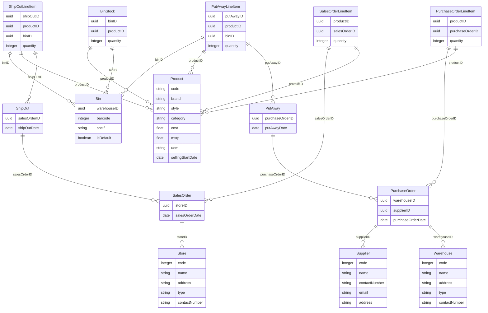

# warehouse management

## Design update

The goal is to introduce three new entities, generalLedger, generalLedgerLineItem, ledgerWallet to the application which resembles an event driven approach. 

General Ledger - The General ledger is the receipt for a transaction like sale or purchase and contains the final sum of the transaction, the total credits and debits. It also has a reference to the transaction item against which the ledger is created.

General Ledger Line Item - The General Ledger Line Item is the line item for a transaction like sale line item and contains the individual credit and debit amounts. It also has a reference to the ledger wallet against which the line item is created.

Ledger Wallet - Is a virtual wallet that holds the balance of the ledger. It is used to calculate the balance of the ledger and is updated with the credit and debit amounts from the ledger line items.

All the items are associated to the store.

---

Actions:
1. When a user create a new sales order 
   1. Event based executor must capture the sales order and trigger pipeline createGeneralLedgerTrx
   2. The pipeline createGeneralLedgerTrx must create a new general ledger for the sales order with transaction type as sale and balances as 0.
2. When a user create a new sales order line item
   1. Event based executor must capture the sales order line item and trigger pipeline createGeneralLedgerLineItem
   2. The pipeline createGeneralLedgerLineItem must create a new general ledger line item for the sales order line item
   3. Trigger executor/pipeline recalulateGeneralLedger
   4. TODO: The recalulateGeneralLedger must update the general ledger with the new balance by summing the credit and debit amounts from the general ledger line items.
   5. TODO: Trigger executor/pipeline updateLedgerWallet

## Overview
Features

## Database Schema


## Usage
To deploy this template, run the following commands

```
make init
make apply
make seed
```
 
To gain further insight into the data structure, visit the [Tailor Console](https://console.tailor.tech) and explore the data schema using live sample data.


